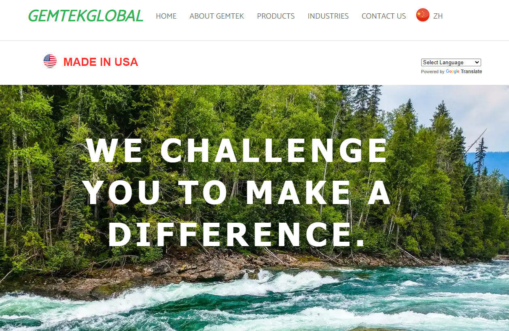

# GEMTEKGLOBAL.com
Gemtekglobal.com is a website that I built for a client in the DMV area. GEMTEK® and it’s Products are leaders and exporters of the fastest growing niche market of the chemical industry – BIO-BASED. Going into its third decade as a pioneer in the biobased industry, GEMTEK® Products continues to dedicate itself to the research, development and production of non-toxic, environmentally-safe cleaners, degreasers, solvents, and specialty chemicals. GEMTEK® will continue to set the “gold” standard by providing its customers with superior performance products that are safe for people and the environment.

**link to project:** http://gemtekglobal.com

## How It's Made:

**Tech used:** HTML, CSS, Javascript, Bootstrap

The first step I took to build Gemtekglobal was to choose between using bootstrap or tailwind. Using a CSS framework would speed up the time needed to build the website. I ended up going with bootstrap because I have more hands on experience with bootstrap than tailwind. My client's customers are located all around the world so I had to make sure that I had a translator tool avaiable on every page and that the website looked good. I used ...Lorem ipsum dolor sit amet, consectetur adipisicing elit. Ab odio eum voluptate hic asperiores voluptatum et laborum nulla assumenda in suscipit pariatur ratione, voluptates dolor maiores nisi dolorem eius nemo! Non cupiditate nihil tenetur illum facilis magni porro sunt aperiam maiores et corrupti, eaque sed, veritatis quasi, officia laboriosam aliquam eligendi fugiat enim dignissimos soluta!

## Optimizations

I love the look of a white background so I decided to go with that. Lorem ipsum dolor, sit amet consectetur adipisicing elit. Quam libero in omnis, quia, nemo unde itaque eos, repellendus possimus explicabo voluptate voluptatum veniam! Sed quos totam nisi tenetur quibusdam, rerum consequuntur magni tempore laudantium sunt, voluptatum quo aut laboriosam ad ut voluptatibus consequatur asperiores facilis.

## Lessons Learned:

I had trouble with making the orginial poster's username appear on their post but learned about Lorem ipsum dolor, sit amet consectetur adipisicing elit. Quam libero in omnis, quia, nemo unde itaque eos, repellendus possimus explicabo voluptate voluptatum veniam! Sed quos totam nisi tenetur quibusdam, rerum consequuntur magni tempore laudantium sunt, voluptatum quo aut laboriosam ad ut voluptatibus consequatur asperiores facilis.

## Examples:
Take a look at these few examples that I have in my own portfolio:

**Client Work:** https://github.com/leandro-alba/cartax

**Happy Notes:** https://github.com/leandro-alba/happy-notes

**Dora:** https://github.com/leandro-alba/dora3
